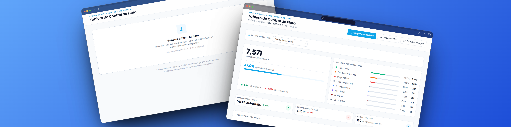

# SCF · Tablero de Control de Flota · Dashboard Generator

Generador de tableros de control y analítica visual de flota vehicular **100% Client-Side**. Diseñado para procesar exportaciones CSV y planillas Excel (`.xlsx`, `.xls` como AppSheet) de gran volumen (hasta 30 MB / +10 000 registros) directamente en el navegador sin enviar datos a servidores externos.

---

## 🚀 Características Principales

- **🔒 Privacidad y Procesamiento Client-Side:** Carga y analiza datos localmente en formato CSV o Excel (`.xlsx`, `.xls`) usando PapaParse en Web Workers y SheetJS. Ninguna información sensible sale de tu dispositivo.
- **⚡ Alto Rendimiento con Grandes Volúmenes:** Capaz de procesar miles de filas en milisegundos sin congelar la interfaz de usuario.
- **🧠 Detección Inteligente de Columnas:** Mapeo automático de campos (estatus, ubicación/estado, gerencia, marca, modelo, clase, GPS, combustible, etc.) mediante coincidencia exacta y heurística de substrings.
- **📊 Semántica Operativa y Colores:** Clasificación estandarizada en 8 categorías operativas (Operativo, En Reparación, Inoperativo, Por Desincorporar, Desincorporado, Por Ubicar, Hurtado, Otros Entes) con semáforos visuales (Verde ≥80%, Amarillo ≥50%, Rojo <50%).
- **🗺️ Filtros por Estado / Región:** Filtrado dinámico por estado geográfico con selección interactiva y autodetección cuando la flota pertenece a una sola entidad.
- **📈 Visualización Interactiva:** Gráficos de dona y barras horizontales construidos con Chart.js.
- **📋 Métricas Ejecutivas e Indicadores de Completitud:** Tarjetas KPI de resumen, rendimiento por región/estado, gerencia y nivel de completitud de datos (Identificación Técnica, Ubicación y Estatus).
- **📄 Exportación a PDF y PNG:** Generación de reportes PDF A4 Landscape multipágina por secciones con encabezado corporativo, numeración dinámica (`Página X de Y`) y fuentes incrustadas mediante `html2canvas-pro` y `jsPDF`.

---

## 🛠️ Stack Tecnológico

| Tecnología                     | Descripción / Uso                                                    |
| :----------------------------- | :------------------------------------------------------------------- |
| **HTML5 + Vanilla JS (ES6+)**  | Arquitectura nativa modular sin frameworks pesados.                  |
| **Tailwind CSS v3 (Play CDN)** | Sistema de diseño adaptable basado en superficies Slate y tonos Sky. |
| **PapaParse**                  | Parser CSV multihilo (`worker: true`).                               |
| **SheetJS (XLSX)**             | Parser client-side para archivos Excel (`.xlsx`, `.xls`).            |
| **Chart.js**                   | Gráficos interactivos de alto rendimiento.                           |
| **html2canvas-pro + jsPDF**    | Motor de captura e impresión de reportes en PDF/PNG.                 |

---

## 📂 Estructura del Proyecto

```text
scf-dashboard-generator/
├── assets/
│   ├── banner.png           # Banner principal del proyecto
│   └── img/                 # Imágenes, capturas y diagramas del proyecto
├── js/
│   ├── config.js            # Mapeos de estatus, alias de columnas y paleta cromática
│   ├── parser.js            # Lógica de carga y normalización de CSV/Excel (PapaParse + SheetJS)
│   ├── processing.js        # Motor de agregaciones de datos O(n)
│   ├── charts.js            # Inicialización y gestión de gráficos Chart.js
│   ├── ui.js                # Renderizado de componentes UI y tarjetas KPI
│   └── export.js            # Motor de generación de reportes PNG y PDF multipágina
├── sample/
│   └── flota_muestra.csv    # CSV de muestra para pruebas
├── favicon.svg              # Icono del proyecto
├── index.html               # Interfaz principal (Bento UI layout + Filtros)
└── README.md                # Documentación del proyecto
```

---

## ⚙️ Ejecución Local

No requiere proceso de compilación ni instalación de dependencias (`node_modules`).

1. **Clonar el repositorio:**

   ```bash
   git clone https://github.com/tu-usuario/scf-dashboard-generator.git
   cd scf-dashboard-generator
   ```

2. **Iniciar un servidor local simple:**

   ```bash
   python3 -m http.server 8080
   ```

3. **Abrir en el navegador:**
   Navega a `http://localhost:8080` y carga el archivo de muestra `sample/flota_muestra.csv` o tu propio archivo CSV/Excel.

---

Este proyecto está bajo la licencia MIT. Consulta el archivo `LICENSE` para más detalles.
